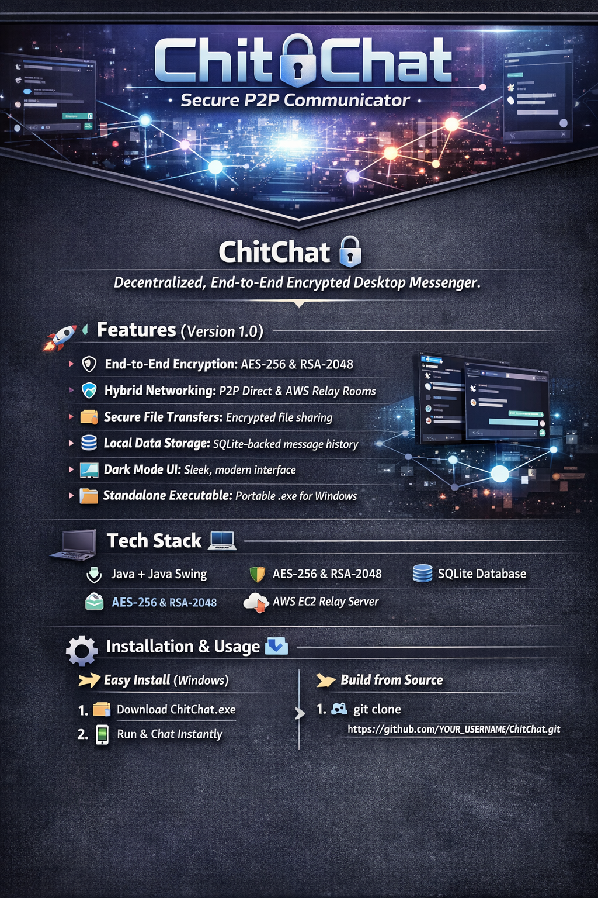

<p align="center">
  
</p>

<h1 align="center">🔒 ChitChat</h1>
<h3 align="center">Decentralized • End-to-End Encrypted • Peer-to-Peer Communicator</h3>

<p align="center">
  
  
  
  
</p>

---

## 🧠 Overview

**ChitChat** is a **secure, decentralized desktop messaging system** engineered for **privacy-first communication**.  

Built entirely in Java, it enables:
- 🔗 Direct peer-to-peer communication (LAN)
- ☁️ Secure multi-user chats via AWS relay
- 🔐 End-to-end encrypted messaging & file transfer  

> ⚡ *No data leaks. No intermediaries. Full ownership.*

---

## ✨ Core Value Proposition

| Capability | Impact |
|-----------|--------|
| 🔐 End-to-End Encryption | Zero visibility to servers |
| 🌐 Hybrid Networking | Works locally & globally |
| 💾 Local Data Storage | Full data ownership |
| ⚡ Lightweight Execution | Fast & efficient |
| 🎯 Standalone App | No setup complexity |

---

## 🚀 Features (v1.0)

### 🔐 Security First
- AES-256 symmetric encryption  
- RSA-2048 key exchange  
- Zero plaintext exposure  

### 🌍 Hybrid Communication Model
- **Direct Mode (P2P):** Instant LAN messaging  
- **Relay Mode:** AWS-based encrypted group communication  

### 📁 Secure File Sharing
- Send any file type  
- Fully encrypted transmission  

### 💽 Local Persistence
- SQLite-based chat storage  
- No external database dependency  

### 🎨 Premium UI/UX
- Dark mode interface  
- Clean, distraction-free layout  
- Custom usernames  

### ⚙️ Plug & Play
- Native `.exe` build  
- No terminal required  

---

## 🏗️ Architecture Overview

```text
        ┌───────────────┐
        │   Client A    │
        └──────┬────────┘
               │ P2P (LAN)
        ┌──────▼────────┐
        │   Client B    │
        └───────────────┘

        OR (Global Mode)

        Client A ──┐
                    ├──▶ AWS Relay Server ──▶ Client B / Group
        Client C ──┘
